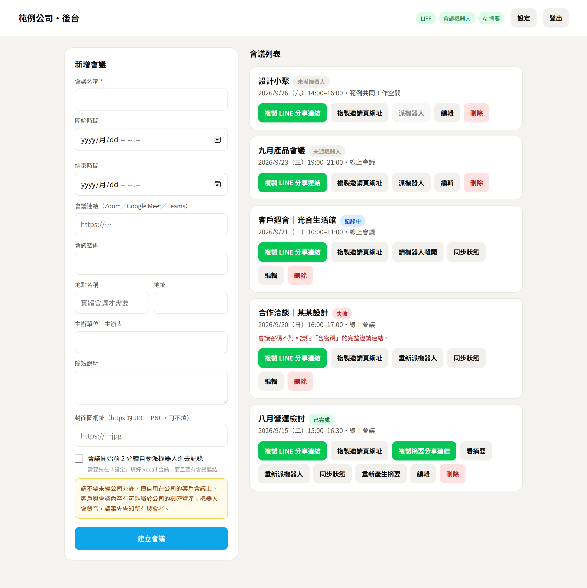
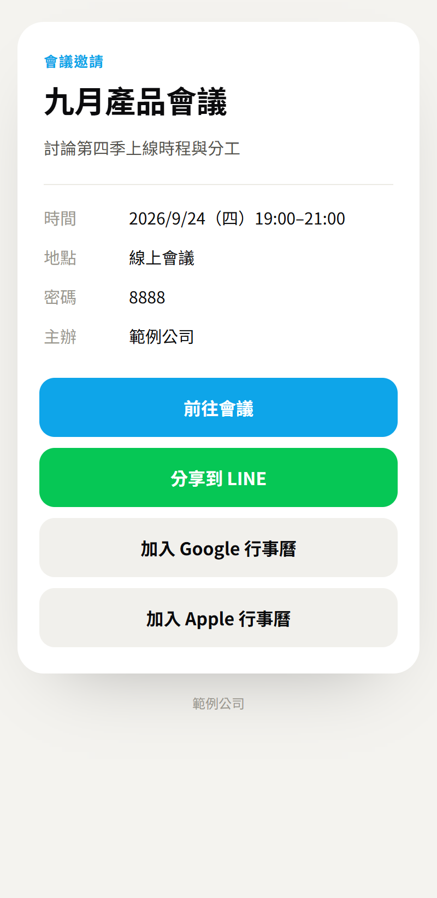
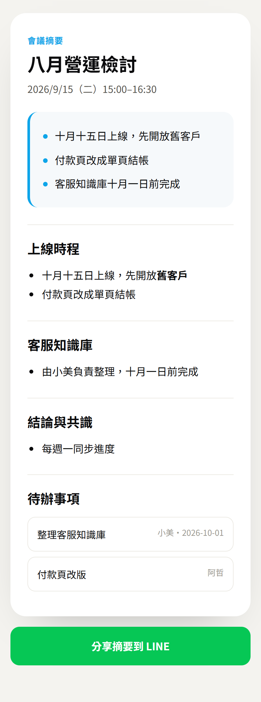
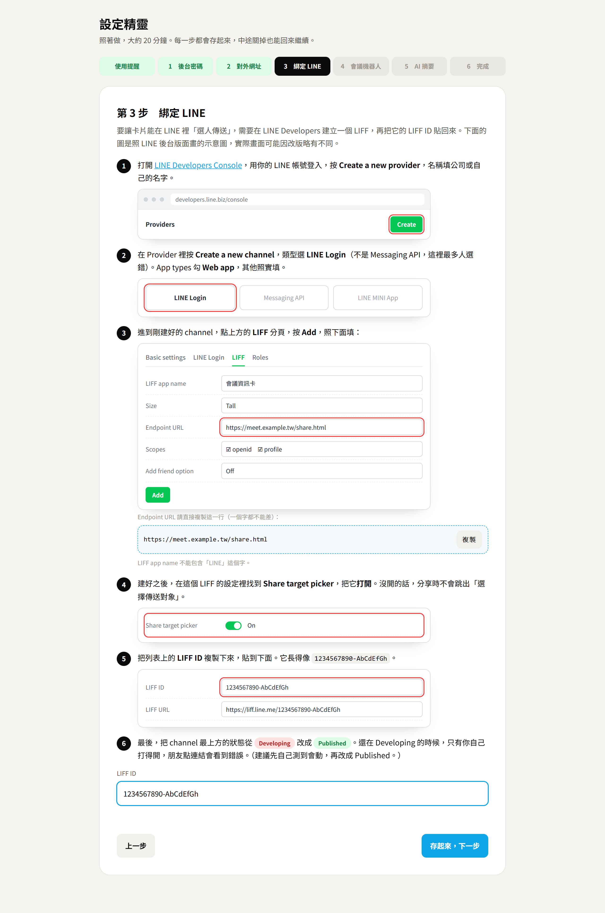

# line-meeting-card

把一場會議變成一張可以在 LINE 裡轉傳的資訊卡，還能派機器人進會議做記錄。

收到卡片的人不用裝任何東西：一張卡片上就有時間、地點、會議連結，按一下加入 Google 或 Apple 行事曆，再按一下就能轉傳給下一個人。

```
後台建立會議 ─→ 複製「LINE 分享連結」─→ 在 LINE 點開 ─→ 選好友或群組 ─→ 對方收到資訊卡
                                                                        │
                        會議開始前 2 分鐘，機器人自動進會議記錄 ←────────┘（選用）
                        會後自動產生摘要 ─→ 再用同一招把「摘要卡」分享出去（選用）
```

> **使用前請先看這一段**
>
> **請不要未經公司允許，擅自使用於公司的客戶會議。客戶與會議內容有可能屬於公司的機密資產。**
> 機器人進會議會錄音並產生逐字稿，請事先取得同意、告知所有與會者，並遵守公司的保密規定與當地法規。設定精靈的第一步會請你確認這件事，沒確認之前不能派機器人。

## 長什麼樣子

後台：建立會議、複製 LINE 分享連結、派機器人、看每一場的狀態。



| 收到卡片的人點進來看到的邀請頁 | 會後摘要頁 |
|---|---|
|  |  |

（畫面是示範資料。想重新產生截圖：`npm i -D playwright-core` 之後執行 `node scripts/screenshots.js`。）

## 這個專案教你什麼

| 主題 | 你會學到 | 文件 |
|---|---|---|
| LIFF | 在 LINE Developers 建立 LIFF、`liff.init`、`shareTargetPicker`，以及五個最常卡住的地方 | [docs/02-line-liff.md](docs/02-line-liff.md) |
| Flex Message | 卡片怎麼排、哪些寫法會讓 LINE 默默拒收 | [docs/02-line-liff.md](docs/02-line-liff.md#flex-卡片的雷) |
| 部署 | 本機加通道先跑起來，再搬到雲端或自己的主機 | [docs/03-deploy.md](docs/03-deploy.md) |
| 會議機器人 | 用 Recall.ai 派機器人進 Zoom／Meet／Teams、拿逐字稿、做摘要 | [docs/04-meeting-bot.md](docs/04-meeting-bot.md) |
| Claude Code | 用講的改版型、加欄位、換資料庫 | [docs/05-claude-code.md](docs/05-claude-code.md) |

第一次來，照 [docs/01-quick-start.md](docs/01-quick-start.md) 走，大約 30 分鐘可以在自己的 LINE 裡傳出第一張卡。

## 三個功能可以分開用

| 功能 | 需要什麼 | 不設定會怎樣 |
|---|---|---|
| 資訊卡分享 | LINE Developers 帳號（免費）＋一個 https 網址 | 這是主功能，一定要設 |
| 會議機器人 | Recall.ai 帳號（依使用時數計費，價格以官網為準） | 後台的「派機器人」會提示還沒設定，其他照常 |
| AI 摘要 | 任何 OpenAI 相容的 API 金鑰 | 只保留逐字稿，不產生摘要 |

## 快速開始

不用改任何檔案，三行指令加一個網頁精靈。指令請一行一行貼。

```bash
git clone https://github.com/arcusdigitaltw/line-meeting-card.git
cd line-meeting-card
npm install
```

```bash
npm start
```

啟動後，視窗裡會出現一組 **6 位數的設定碼**。用瀏覽器打開 `http://localhost:3000/setup.html`，照著精靈一步一步做：

1. 閱讀使用提醒
2. 用設定碼設定後台密碼
3. 確認對外網址（LINE 只接受 https）
4. 綁定 LINE：圖解帶你在 LINE Developers 建立 LIFF，貼回 LIFF ID
5. 會議機器人：貼上 Recall.ai 的 API Key，當場測試能不能用（可跳過）
6. AI 摘要：貼上語言模型的金鑰（可跳過）



設定存在 `data/config.json`，存完立刻生效，不用重啟。習慣用 `.env` 的人也可以照 `.env.example` 設定，環境變數的優先權比精靈高。

需要 Node.js 18 以上。只依賴 `express` 和 `dotenv` 兩個套件，不用裝資料庫。

## 專案結構

```
line-meeting-card/
├── server.js            所有網址路由、後台權限、每分鐘的機器人排程
├── lib/
│   ├── config.js        設定：環境變數優先，其次是設定精靈存的 data/config.json；後台密碼存雜湊
│   ├── card.js          ★ 卡片核心：Flex Message、.ics、Google 行事曆（純函式，最適合拿來改）
│   ├── store.js         資料層：讀寫 data/meetings.json
│   ├── recall.js        會議機器人：派出、查狀態、下載逐字稿
│   └── summary.js       會後摘要：呼叫語言模型
├── public/
│   ├── share.html       ★ LIFF 分享頁（LIFF 的 Endpoint URL 就填這一頁）
│   ├── invite.html      會議邀請頁（收到卡片的人點「查看完整資訊」會到這裡）
│   ├── summary.html     會後摘要頁
│   ├── setup.html       ★ 設定精靈：密碼、對外網址、綁定 LINE、Recall 金鑰、AI 金鑰
│   └── admin.html       後台
├── scripts/
│   ├── print-flex.js    印出卡片 JSON，貼到 LINE 官方模擬器預覽
│   ├── smoke.js         不用連 LINE 的整體自我檢查
│   ├── smoke-setup.js   設定精靈的自我檢查
│   ├── check-pages.js   檢查每一頁前端程式的語法
│   └── screenshots.js   重新產生 docs/img 的截圖
├── test/card.test.js    單元測試
├── docs/                教學
├── CLAUDE.md            給 Claude Code 看的專案說明
└── .env.example         設定範本
```

## 常用指令

| 指令 | 用途 |
|---|---|
| `npm start` | 啟動 |
| `npm run dev` | 啟動，改檔案會自動重啟 |
| `npm test` | 單元測試（改完 `lib/card.js` 一定要跑） |
| `npm run smoke` | 整體自我檢查：建會議、拿卡片、行事曆、權限 |
| `npm run flex` | 印出邀請卡 JSON；`npm run flex summary` 印摘要卡 |

## 安全上要知道的事

- 後台所有操作都要密碼。密碼在設定精靈裡設（至少 10 個字，只存雜湊不存明文）；第一次設密碼需要啟動視窗裡的設定碼，避免別人搶先幫你設。連續猜錯 10 次會被擋 15 分鐘。
- Recall 與語言模型的金鑰存在你自己主機的 `data/config.json`（或 `.env`），後台只會顯示最後四碼。
- 邀請頁與摘要頁靠「猜不到的網址」保護，拿到連結的人就看得到。**邀請卡只公開標題、時間、地點、會議連結**；逐字稿與摘要走另一組代碼，不會因為轉傳邀請卡而外流。
- 會議密碼會顯示在卡片上。不想公開就不要填，改用含密碼的會議連結。
- 機器人進會議時會在聊天室自我介紹並說明正在記錄。錄音錄影請遵守當地法規，並事先告知與會者。
- `.env` 和 `data/` 已經列在 `.gitignore`，不要把它們推上 GitHub。

## 授權

MIT。可以自由使用、修改、商用，保留授權聲明即可。

由葉治皓（Yeh Chih Hao）整理開源。
