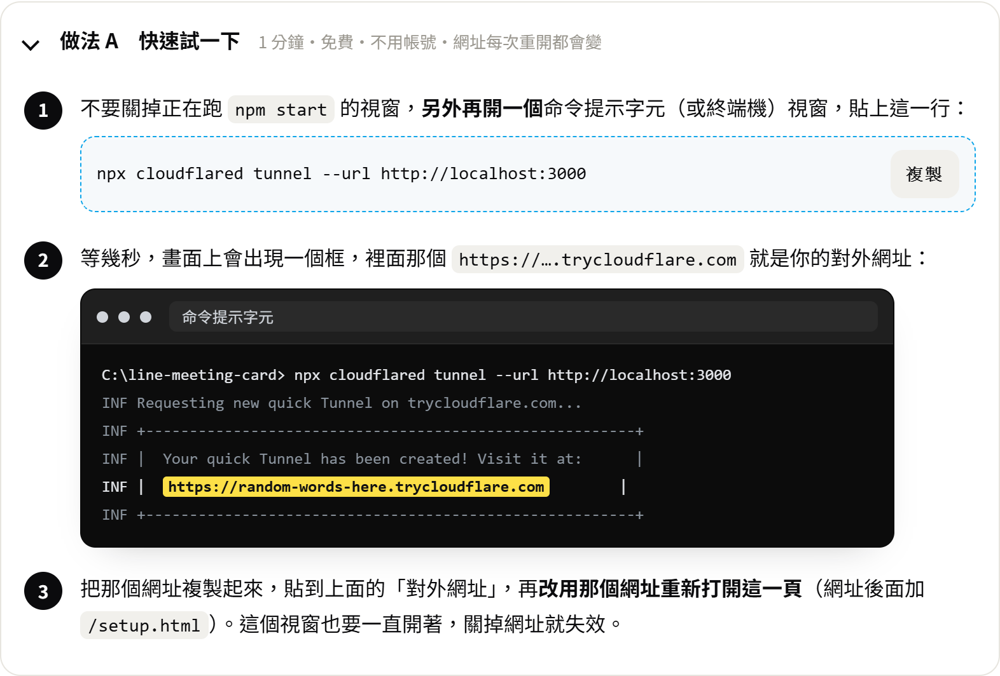

# 01・三十分鐘傳出第一張卡

照順序做。每一步後面都寫了「怎樣算成功」，沒成功先不要往下。

## 你需要準備

- 一台裝了 Node.js 18 以上的電腦（終端機打 `node -v` 看得到版本就行）
- 一個 LINE 帳號（你平常用的那個就可以）
- 手機上的 LINE

## 步驟一：把專案跑起來

指令請一行一行貼。

```bash
npm install
```

然後跑自我檢查：

```bash
npm run smoke
```

**成功的樣子**：最後一行是「全部通過」。這一步不需要連 LINE，只是確認程式本身沒問題。

## 步驟二：讓外面連得到你的電腦

LINE 只接受 `https` 網址，`http://localhost` 不行。最快的方法是開一條臨時通道：

下面兩個工具選一個就好。

```bash
npx cloudflared tunnel --url http://localhost:3000
```

或是：

```bash
ngrok http 3000
```

它會給你一個 `https://xxxx.trycloudflare.com`（或 `https://xxxx.ngrok-free.app`）的網址，先記下來，下一步會用到。畫面會長這樣，黃色那一行就是你的網址：



這個視窗要一直開著，關掉網址就失效。有自己的網域、想要固定的網址，改看 [06-cloudflare-domain.md](06-cloudflare-domain.md)。

> 臨時通道每次重開網址都會變。變了之後，設定精靈裡的「對外網址」和 LINE 後台的 Endpoint URL 都要跟著改。正式使用請看 [03-deploy.md](03-deploy.md)。

## 步驟三：打開設定精靈

啟動程式：

```bash
npm start
```

視窗裡會出現一行「設定碼：123456」。用瀏覽器打開**步驟二拿到的 https 網址**加上 `/setup.html`，例如 `https://xxxx.trycloudflare.com/setup.html`。

精靈會帶你做完這些事，每一步都有圖解：

| 步驟 | 做什麼 |
|---|---|
| 使用提醒 | 確認你不會未經公司允許，用在公司的客戶會議上 |
| 後台密碼 | 輸入視窗裡的設定碼，設一組至少 10 個字的密碼 |
| 對外網址 | 確認是 https 的網址 |
| 綁定 LINE | 照圖在 LINE Developers 建立 LIFF，把 LIFF ID 貼回來 |
| 會議機器人 | 貼上 Recall.ai 的 API Key，按「測試金鑰」（可跳過） |
| AI 摘要 | 貼上語言模型的金鑰（可跳過） |


**成功的樣子**：最後一頁「設定完成」裡，後台密碼、對外網址、綁定 LINE 三項都是綠色。

> 想了解每個 LINE 設定背後的原因，看 [02-line-liff.md](02-line-liff.md)。

## 步驟四：建一場會議，傳出去

1. 在精靈最後一頁按「進入後台」。右上角「LIFF」標籤是綠色的才對。
2. 左邊填會議名稱、時間、會議連結，按「建立會議」。
3. 在右邊那場會議按「複製 LINE 分享連結」。
4. 把連結貼到 LINE 的任何聊天室（傳給自己的「Keep 筆記」最方便），**在手機上點開**。
5. 畫面跳出「選擇傳送對象」→ 選一個好友或群組 → 傳送。

**成功的樣子**：對方的聊天室出現一張卡片，有會議名稱、時間，下面有「前往會議」「加入 Google 行事曆」「加入 Apple 行事曆」「查看完整資訊」。

## 沒成功？

| 你看到的 | 多半是 |
|---|---|
| 點開連結是白畫面，或顯示 400 | LINE 後台的 Endpoint URL 沒填對，要是 `https://你的網址/share.html` |
| 「站長還沒設定 LIFF ID」 | 設定精靈的「綁定 LINE」還沒做完 |
| 設定碼不對 | 設定碼每次啟動都會換，請看「現在這一次」`npm start` 的視窗 |
| 「這個 LIFF 還不能分享」 | LIFF 設定裡的 Share target picker 沒打開 |
| 只有你自己能用，朋友點開說沒有權限 | LINE Login channel 還在 Developing，要改成 Published |
| 選了人、按了傳送，但什麼都沒發生 | 卡片裡有空字串，跑 `npm test` 看哪裡壞了 |
| 電腦瀏覽器打開只看到「請用 LINE 開啟」 | 正常。選人傳送這一步要在手機的 LINE 裡做 |

更完整的排錯在 [02-line-liff.md](02-line-liff.md#五個最常卡住的地方)。
