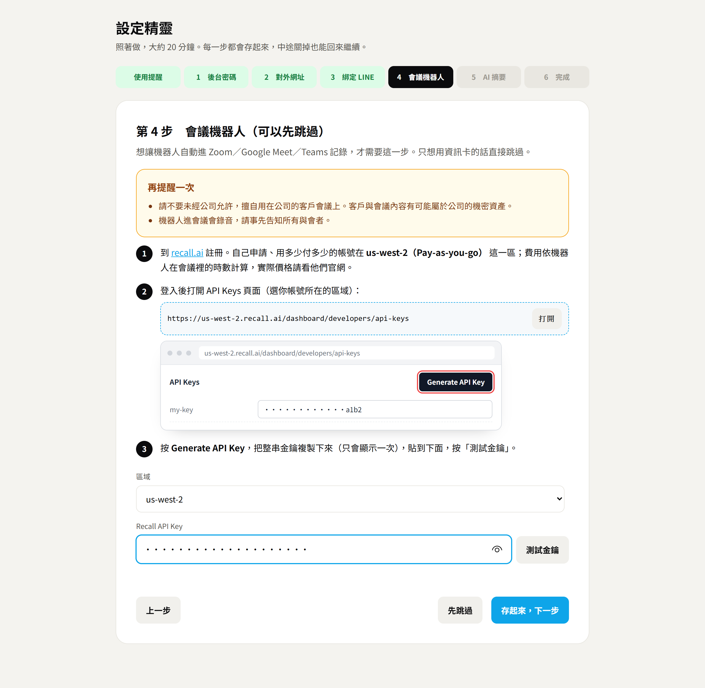

# 04・把會議機器人綁上來

> **使用前請先看這一段**
>
> **請不要未經公司允許，擅自使用於公司的客戶會議。客戶與會議內容有可能屬於公司的機密資產。**
> 機器人進會議會錄音並產生逐字稿，請事先取得同意、告知所有與會者，並遵守公司的保密規定與當地法規。設定精靈的第一步會請你確認這件事，沒確認之前不能派機器人。


資訊卡解決「把人找來開會」，機器人解決「開完會之後」。綁上之後流程變成：

```
建立會議（勾「自動派機器人」）
   └→ 開始前 2 分鐘，機器人自己進 Zoom／Google Meet／Teams
        └→ 在聊天室自我介紹，開始記錄
             └→ 會議結束，自動下載逐字稿
                  └→ 產生摘要（三到五條重點＋完整摘要＋待辦）
                       └→ 後台按「複製摘要分享連結」，用同一個 LIFF 把摘要卡傳到群組
```

邀請卡和摘要卡共用同一個 LIFF，不用再設第二個。

## 它是怎麼做到的

機器人不是我們自己寫的。我們用 [Recall.ai](https://www.recall.ai) 這個服務：告訴它會議連結，它就派一個「與會者」進去錄音並轉成逐字稿，我們只要會後去拿結果。

這個專案刻意選了最簡單的接法：**不設 webhook，每分鐘主動去問一次機器人的狀態**（`server.js` 最下面的 `tick()`）。好處是少一個要設定和驗證的東西；代價是後台的狀態最多慢一分鐘。

## 設定

### 1. 申請 Recall.ai

1. 到 Recall.ai 註冊，在後台建立 API Key。
2. 記下你帳號的**區域**。Recall 的 API 網址是分區的，區域填錯會一直回「金鑰不正確」。常見的有 `us-west-2`、`us-east-1`、`eu-central-1`、`ap-northeast-1`。

費用依機器人在會議裡的時數計算，實際價格與免費額度請看他們官網。

### 2. 在設定精靈貼上金鑰

打開 `/setup.html` 的「會議機器人」那一步（已經設定過的話，從後台右上角的「設定」進去）：

1. 選你帳號所在的區域，按「打開」會直接帶你到那一區的 API Keys 頁面。
2. 在 Recall 後台按 **Generate API Key**，把整串金鑰複製回來貼上。
3. 按「測試金鑰」。它會實際問 Recall 一次（不會產生費用），金鑰或區域錯了當場就知道。
4. 按「存起來」。存完立刻生效，不用重啟。



機器人在會議裡顯示的名字預設是「品牌名・會議記錄」。想改的話，在 `.env` 加一行 `BOT_NAME=某某公司・會議記錄`。建議寫清楚是誰家的、來做什麼，與會者看到陌生帳號進來才不會緊張。

習慣用 `.env` 的人也可以直接設 `RECALL_API_KEY` 與 `RECALL_REGION`，效果一樣。

### 3.（選用）AI 摘要

在設定精靈的最後一步貼上金鑰即可；也可以在 `.env` 設 `LLM_API_KEY`、`LLM_BASE_URL`、`LLM_MODEL`。

只要是 OpenAI 相容格式（`/v1/chat/completions`）都能接：OpenAI、OpenRouter、自己架的 OneAPI 或 Ollama，改 `LLM_BASE_URL` 就好。不填就只保留逐字稿。

## 使用

**自動**：建立會議時勾「會議開始前 2 分鐘自動派機器人進去記錄」。要有開始時間和會議連結。

**手動**：後台那場會議按「派機器人」。臨時開的會、或自動派失敗想重派時用。

後台的狀態：

| 狀態 | 意思 |
|---|---|
| 未派機器人 | 還沒出發 |
| 機器人加入中 | 已派出，可能正在等候室 |
| 記錄中 | 已經在會議裡 |
| 整理逐字稿 | 會議結束，等語音轉文字完成（通常幾分鐘） |
| 已完成 | 逐字稿拿到了；有設 AI 的話摘要也好了 |
| 失敗 | 下面會用白話寫原因 |

想提早結束，按「請機器人離開」。

## 機器人進不去？

這是最常遇到的問題，原因幾乎都在會議設定，不在程式。

| 後台顯示的原因 | 怎麼處理 |
|---|---|
| 在等候室等了 5 分鐘沒被放行 | 請主持人放行，或把會議設成不需要等候室 |
| 會議密碼不對 | 會議連結請貼「含密碼」的完整邀請連結（Zoom 的連結後面有 `?pwd=…`）。只貼會議 ID 的網址機器人進不去 |
| 這場會議要求登入才能加入 | Zoom 關掉「僅限已驗證的使用者可加入」；Google Meet 改成允許組織外的人加入 |
| 會議還沒開始 | 主持人還沒開會議室。Zoom 可以開「允許與會者在主持人之前加入」 |
| Recall 帳戶額度不足 | 去 Recall 後台儲值 |
| RECALL_API_KEY 不正確，或區域選錯 | 先檢查 `RECALL_REGION` |

### Zoom 連結被截斷

從 LINE 或簡訊複製 Zoom 連結時，`?pwd=` 後面那串常常被切掉一半，看起來像完整網址，但機器人會因為密碼不對進不去。建立會議時請從 Zoom 的「複製邀請連結」直接複製。

## 中文逐字稿的選擇

`lib/recall.js` 的 `transcriptProvider()` 決定用哪一家語音轉文字：

- **中文**：用 Recall 自家的 `recallai_streaming`，模式選 `prioritize_accuracy`。我們實測過幾家，中文會議這個最穩。
- **英文**：用 `meeting_captions`，也就是 Zoom／Meet 內建的字幕。免費，英文夠用；但它的中文幾乎不能用，所以中文會議不要選這個。

目前後台沒有語言選項，預設中文。要開英文會議，可以在建立會議的 API 帶 `language: "en"`，或請 Claude Code 幫你在後台加一個下拉選單。

## 摘要的品質

`lib/summary.js` 有兩道保險：

1. **逐字稿不到 300 字就不做摘要。** 內容太少時語言模型會自己編一份看起來很合理的會議紀錄，寧可不給也不要給假的。
2. **提示詞明講「逐字稿沒提到的事一律不要寫」。**

想改摘要的格式（例如改成你們公司的會議紀錄範本），直接改 `summarize()` 裡的那段提示詞就好。

## 法遵與禮貌

- 機器人進會議會在聊天室發一段自我介紹，說明是誰邀請的、正在記錄。這段文字在 `server.js` 的 `deploy()` 裡，可以改，但**請不要拿掉**。
- 各地對錄音的規定不同。對外的會議請在邀請時就先說明會記錄。
- 逐字稿和摘要存在你自己的主機上（`data/meetings.json`），摘要頁靠猜不到的網址保護。內容敏感的會議，分享摘要連結前想一下群組裡有誰。
