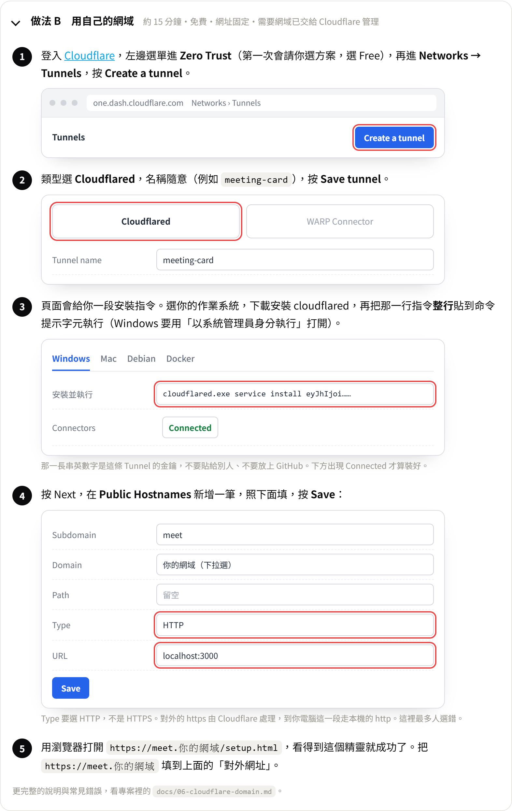

# 06・用 Cloudflare 接上自己的網域

目標：讓 `https://meet.你的網域` 直接連到你電腦（或主機）上跑的這支程式。

用的是 **Cloudflare Tunnel**。它的好處：

- 免費，網址固定（不像臨時通道每次重開都換）。
- 自動有 https 憑證，不用自己申請。
- 不用在路由器開 port、不用固定 IP，家裡或辦公室的電腦都可以。

> Cloudflare 的後台會改版，按鈕位置可能跟這裡寫的略有不同，但名稱大致不變。

## 開始之前

- 你有一個網域，而且**這個網域的 DNS 已經交給 Cloudflare 管**（網域的 nameserver 指到 Cloudflare）。還沒有的話，先在 Cloudflare 後台按 **Add a domain**，照指示到你買網域的地方改 nameserver，等它顯示 Active。
- 程式已經在本機跑起來了：`npm start` 之後，`http://localhost:3000/setup.html` 打得開。

## 做法一：用 Cloudflare 後台（推薦，不用打太多指令）

先看整個流程的圖解。設定精靈的「對外網址」那一步也有同一份，可以邊看邊做。圖是照實際畫面畫的示意圖，紅框是要注意的地方。



### 1. 建立 Tunnel

1. 登入 Cloudflare，左邊選單進 **Zero Trust**。第一次進去會請你取一個團隊名稱、選方案，選 **Free** 就好（可能會要你填付款方式，Free 方案不會扣款）。
2. 進 **Networks → Tunnels**，按 **Create a tunnel**。
3. 類型選 **Cloudflared**，名稱隨意，例如 `meeting-card`，按 **Save tunnel**。

### 2. 在你的電腦裝連接器

後台會顯示一段「安裝並執行」的指令，依你的作業系統選。

**Windows**

1. 照頁面上的連結下載 `cloudflared` 的安裝檔（`.msi`），安裝。
2. 用**系統管理員身分**打開「命令提示字元」，把頁面上那一行指令整行貼上執行。它長得像這樣：

```bash
cloudflared.exe service install 一長串英數字
```

**Mac**

```bash
brew install cloudflared
```

再貼上頁面給你的那一行 `sudo cloudflared service install …`。

> 那一長串英數字是這條 Tunnel 的金鑰，**不要貼給別人、不要放進 GitHub**。拿到它的人可以把你的網域導到他的電腦。

裝好之後，後台下方的 Connectors 會出現一筆，狀態是 **Connected**。它會以系統服務的方式常駐，重開機也會自己啟動。

### 3. 設定網址要導到哪裡

按 **Next**，進到 **Public Hostnames**，新增一筆：

| 欄位 | 填什麼 |
|---|---|
| Subdomain | `meet`（想用什麼子網域就填什麼） |
| Domain | 選你的網域 |
| Path | 留空 |
| Type | `HTTP` |
| URL | `localhost:3000` |

按 **Save**。Cloudflare 會自動幫你建好 DNS 紀錄。

> Type 要選 **HTTP**，不是 HTTPS。對外的 https 由 Cloudflare 處理，Tunnel 到你電腦這一段走的是本機的 http。

### 4. 驗證

瀏覽器打開 `https://meet.你的網域/setup.html`，看得到設定精靈就成功了。

## 做法二：全部用指令

習慣用終端機的人可以這樣做。指令請一行一行貼。

安裝 `cloudflared` 後，先登入（會開瀏覽器請你選網域）：

```bash
cloudflared tunnel login
```

建立 Tunnel：

```bash
cloudflared tunnel create meeting-card
```

把子網域指到這條 Tunnel：

```bash
cloudflared tunnel route dns meeting-card meet.你的網域
```

啟動，把流量導到本機的 3000 port：

```bash
cloudflared tunnel run --url http://localhost:3000 meeting-card
```

這樣是「視窗開著才有效」。要常駐的話，建立設定檔後安裝成服務，做法見 Cloudflare 官方文件的 [Run as a service](https://developers.cloudflare.com/cloudflare-one/connections/connect-networks/do-more-with-tunnels/local-management/as-a-service/)。

## 接上之後要改的兩個地方

網址換了，下面兩處一定要跟著改，而且要一模一樣：

1. **設定精靈的「對外網址」**：打開 `https://meet.你的網域/setup.html`，第 2 步填 `https://meet.你的網域`（結尾不要加斜線）。
2. **LINE Developers 裡 LIFF 的 Endpoint URL**：改成 `https://meet.你的網域/share.html`。精靈第 3 步有一鍵複製。

改完用手機實際分享一張卡，確認選得到人、對方收得到。

## 常見問題

| 狀況 | 多半是 |
|---|---|
| 打開網址看到 Cloudflare 的 **502 Bad Gateway** | 你的程式沒在跑。回到電腦執行 `npm start` |
| 看到 **1033** 或 Tunnel 顯示 Inactive／Down | 連接器沒在跑。Windows 到「服務」裡找 `cloudflared` 重新啟動；或重跑一次安裝指令 |
| 看到 **1016** Origin DNS error | Public Hostname 沒存成功，或子網域打錯。回後台看 DNS 裡有沒有那筆 CNAME |
| 網址打得開，但 LINE 分享說 Endpoint 對不上 | LIFF 的 Endpoint URL 還是舊網址，或多了 `www`、少了 `/share.html` |
| 電腦關機、睡眠之後網址就掛了 | 正常，程式和連接器都在那台電腦上。要 24 小時可用，請改放到一台不關機的主機，見 [03-deploy.md](03-deploy.md) |
| 後台打得開，但不想讓全世界都連得到 `/admin.html` | 後台有密碼保護，連續猜錯會被擋。想再加一層，可以在 Zero Trust 的 **Access → Applications** 對 `meet.你的網域/admin.html` 和 `/setup.html` 加上 Email 驗證；**不要**把 `/share.html`、`/i/`、`/s/`、`/api/card/` 鎖起來，那些是收到卡片的人要用的 |

## 程式要不要一直開著？

要。Tunnel 只是一條通道，網址背後還是你電腦上的 `npm start`。兩個都要在跑：

- **程式**：`npm start`。想讓它常駐、當機自動重啟，可以用 pm2：先執行 `npm install -g pm2`，再執行 `pm2 start server.js --name line-meeting-card`。
- **連接器**：用做法一安裝的話已經是系統服務，會自己常駐。
